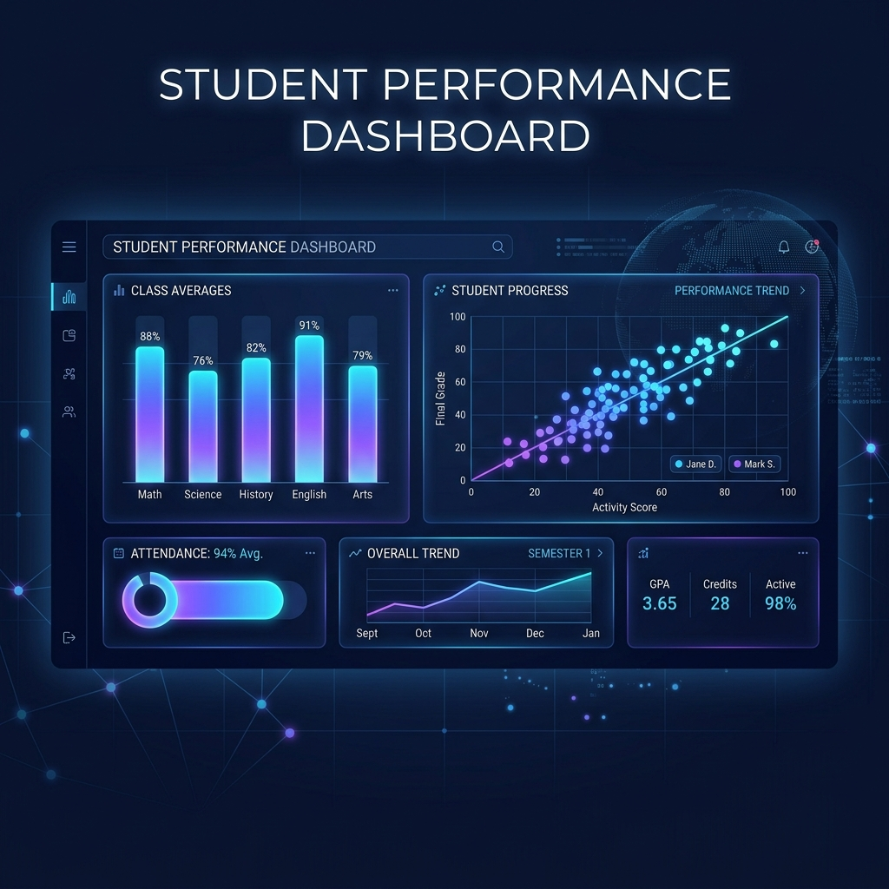
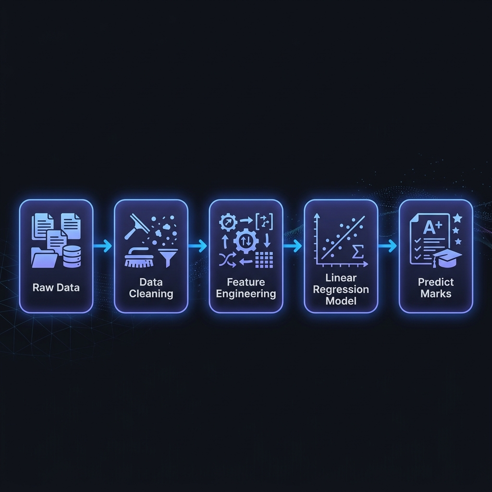
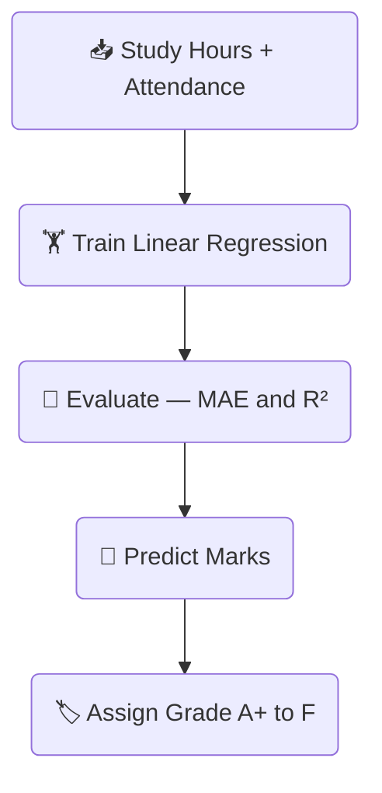
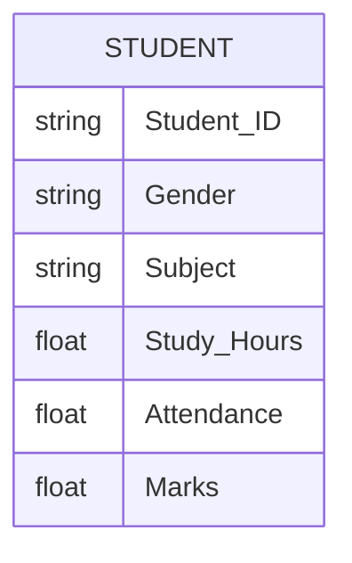

# 🎓 Student Performance Analysis Dashboard

<p align="center">
  
</p>

<p align="center">
  
  
  
  
  
</p>

<p align="center">
  A complete, beginner-friendly <strong>Data Science mini project</strong> built with Python and Streamlit.<br/>
  Analyze student data, visualize patterns, and predict marks — all in an interactive web UI.
</p>

---

## 📦 Tech Stack

| Library | Purpose | Version |
|---|---|---|
| **Streamlit** | Interactive web dashboard UI | ≥ 1.32 |
| **Pandas** | Data loading, cleaning, filtering | ≥ 2.0 |
| **NumPy** | Numerical operations, dataset generation | ≥ 1.24 |
| **Matplotlib** | Bar chart, histogram, scatter plot | ≥ 3.7 |
| **Seaborn** | Correlation heatmap | ≥ 0.12 |
| **Scikit-learn** | Linear Regression model | ≥ 1.3 |

---

## 🔄 Project Architecture


---

## 🤖 ML Pipeline

<p align="center">
  
</p>



---

## 📊 Visualizations Included

```
┌─────────────────────────┬────────────────────────────┐
│  📊 Bar Chart           │  📈 Histogram               │
│  Avg Marks per Subject  │  Marks Distribution         │
├─────────────────────────┼────────────────────────────┤
│  🔵 Scatter Plot        │  🌡️ Heatmap                 │
│  Study Hours vs Marks   │  Correlation Matrix         │
└─────────────────────────┴────────────────────────────┘
```

---

## 🗂️ Dataset Schema



---

## 🏆 Grade Scale

| Score Range | Grade | Label |
|---|---|---|
| 90 – 100 | 🏆 A+ | Outstanding |
| 75 – 89  | 🌟 A  | Excellent |
| 60 – 74  | 👍 B  | Good |
| 50 – 59  | 📘 C  | Average |
| < 50     | ⚠️ F  | Needs Improvement |

---

## 📁 Folder Structure

```
fds/
├── app.py              ← Main Streamlit application (single file)
├── requirements.txt    ← Python dependencies
├── README.md           ← Project documentation
└── assets/
    ├── banner.png      ← Project banner image
    └── ml_workflow.png ← ML pipeline diagram
```

---

## ⚙️ How to Run Locally

### Step 1 — Install Python
Make sure **Python 3.9+** is installed → https://python.org

### Step 2 — Create Virtual Environment *(recommended)*
```bash
python -m venv .venv
.venv\Scripts\activate        # Windows
# source .venv/bin/activate   # macOS / Linux
```

### Step 3 — Install Dependencies
```bash
pip install -r requirements.txt
```

### Step 4 — Run the App 🚀
```bash
streamlit run app.py
```

> The dashboard opens automatically at **http://localhost:8501**

---

## ✨ Features

### 🧹 Data Processing
- Auto-generates 200+ realistic student records
- Handles **missing values** (filled with median)
- Removes **duplicate rows**
- Cleaning report shown in expandable panel

### 📊 Dashboard
- Sidebar filters: **Gender** and **Subject**
- KPI cards: Total Students · Avg Marks · Avg Study Hours · Avg Attendance

### 📈 Visualizations

| Chart | Description |
|---|---|
| **Bar Chart** | Average marks per subject |
| **Histogram** | Marks distribution with mean line |
| **Scatter Plot** | Study Hours vs Marks with gender colors & trend line |
| **Heatmap** | Correlation matrix of numeric features |

### 🤖 Machine Learning
- **Linear Regression** (Scikit-learn)
- Features: `Study_Hours` + `Attendance` → Target: `Marks`
- Metrics: **MAE** and **R²** score displayed in UI

### 🔮 Prediction UI
- Input Study Hours (slider 0–12)
- Input Attendance (slider 40–100%)
- Click **Predict Marks** → shows predicted score + grade badge

### 🎁 Bonus Features
- **📂 Upload Custom CSV** from sidebar
- **⬇️ Download Filtered Data** as CSV

---

## 📝 About This Project

This project is a **Student Performance Analysis Dashboard** — a data science web application that helps you understand how study habits and attendance affect a student's exam marks.

### What it does

- **Generates** a realistic dataset of 200 students with fields like Study Hours, Attendance, Subject, Gender, and Marks
- **Cleans** the data automatically — removes duplicates and fills any missing values
- **Visualizes** patterns through 4 interactive charts so you can spot trends at a glance
- **Predicts** a student's expected marks using a Machine Learning model (Linear Regression) trained on the dataset
- **Filters** all data and charts in real time using the sidebar controls

### How the prediction works

The app trains a **Linear Regression** model using two inputs:

| Input | Description |
|---|---|
| `Study_Hours` | How many hours per day the student studies |
| `Attendance` | The student's class attendance percentage |

The model learns the relationship between these inputs and `Marks` from the training data. When you move the sliders and click **Predict Marks**, it runs `model.predict()` with your values and shows the expected score along with a grade (A+ to F).

### Why the predicted score isn't always 100

Even at maximum Study Hours and Attendance, the model predicts ~86 — not 100. This is because real student data has natural variation (some students with full attendance still score differently), so the regression line finds the realistic average, not the perfect maximum.

---

<p align="center">
  Built with ❤️ for <strong>Foundations of Data Science</strong> · College Submission Project
</p>
