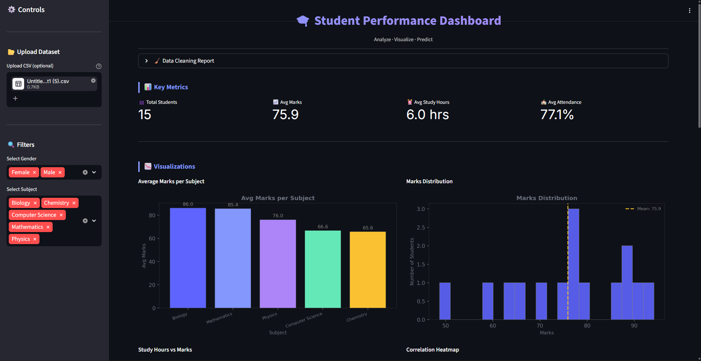
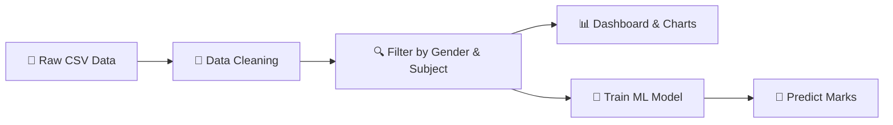
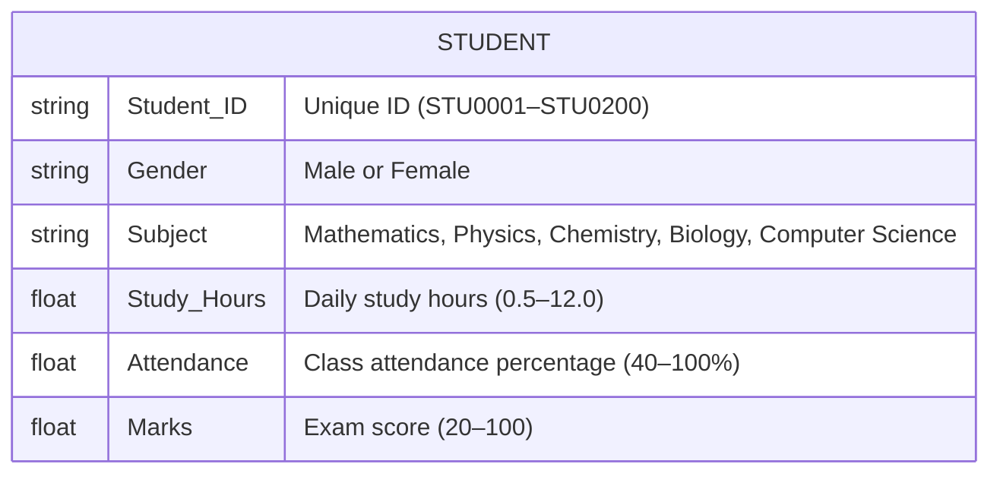
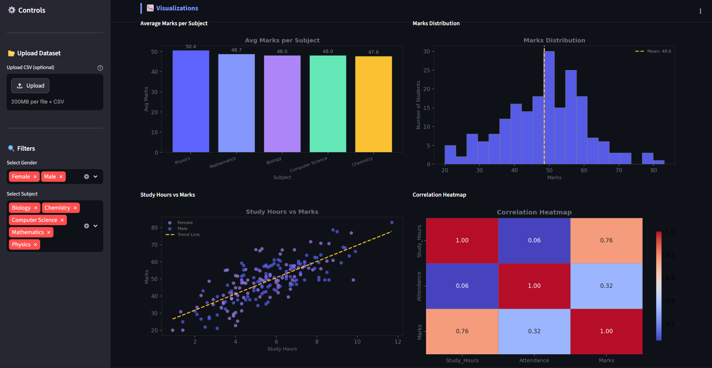
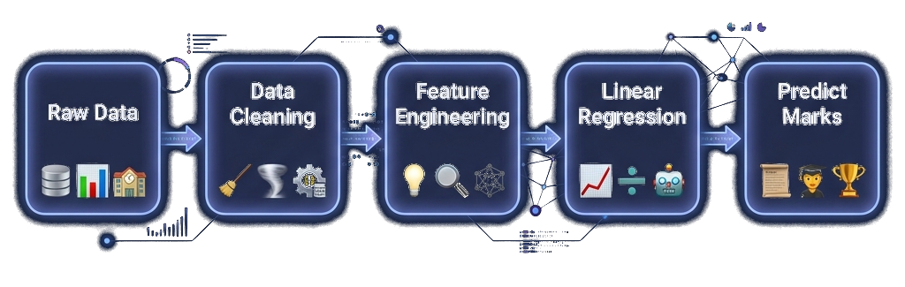
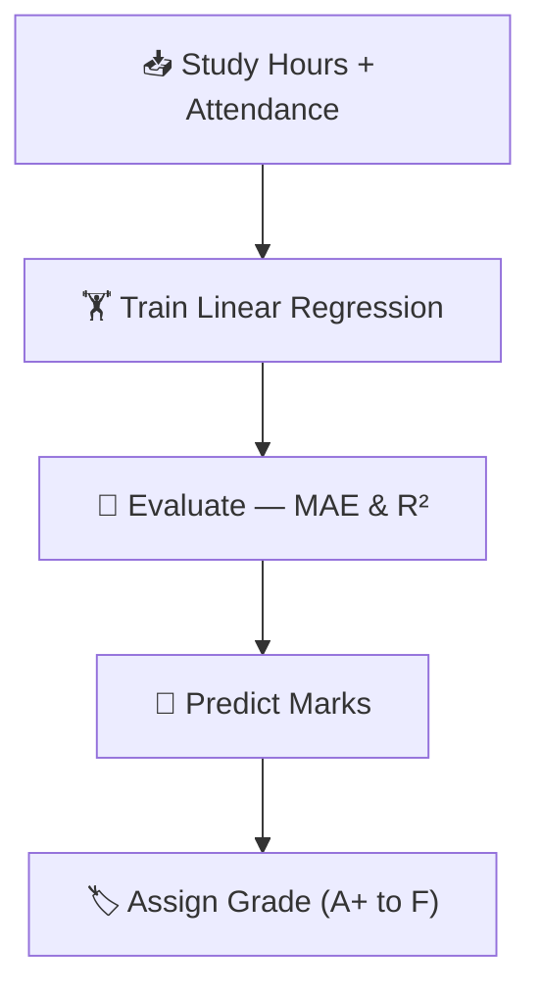

# 🎓 Student Performance Analysis Dashboard

<p align="center">
  
</p>

<p align="center">
  
  
  
  
  
</p>

<p align="center">
  An interactive <strong>Data Science web application</strong> that analyzes student data, uncovers performance patterns through visualizations, and predicts exam marks using Machine Learning — all inside a single-file Streamlit dashboard.
</p>

---

## 🔍 Problem Statement

In educational institutions, understanding **what drives student performance** is essential for providing timely support. However, raw student data — study hours, attendance records, and marks across subjects — is often incomplete and messy, filled with **missing values** and **duplicate entries**. Static spreadsheets make it nearly impossible for educators to quickly spot trends, compare cohorts, or forecast which students may need help.

There was a need for an **interactive, all-in-one tool** that could take raw data, clean it automatically, reveal hidden patterns through charts, and predict a student's expected marks based on their study habits.

---

## 🎯 Objective

Build a complete, end-to-end Data Science mini project that:

1. **Generates** a realistic student dataset with built-in imperfections (missing values, duplicates)
2. **Cleans** the data automatically and transparently reports what was fixed
3. **Visualizes** performance trends through multiple interactive charts
4. **Trains** a Machine Learning model to predict marks from study hours and attendance
5. **Packages** everything into a polished, single-file Streamlit web application

---

## 🏗️ Architecture



---

## 📦 Tech Stack

| Library | Purpose | Version |
|---|---|---|
| **Streamlit** | Interactive web dashboard UI | ≥ 1.32 |
| **Pandas** | Data loading, cleaning, filtering | ≥ 2.0 |
| **NumPy** | Numerical operations, dataset generation | ≥ 1.24 |
| **Matplotlib** | Bar chart, histogram, scatter plot | ≥ 3.7 |
| **Seaborn** | Correlation heatmap | ≥ 0.12 |
| **Scikit-learn** | Linear Regression model & evaluation | ≥ 1.3 |

---

## 🗂️ Dataset Schema

The app generates a synthetic dataset of **200 student records** with realistic correlations. Marks are positively correlated with Study Hours and Attendance, plus random noise for realism. ~5% missing values and ~3% duplicate rows are injected to simulate real-world data quality issues.



---

## 🚀 What We Built

### 🧹 Data Cleaning Pipeline

- Automatically **removes duplicate rows** from the dataset
- **Fills missing values** with the column median for numeric fields
- Displays a **color-coded cleaning report** inside an expandable panel:
  - 🟥 Red — missing values that were filled
  - 🟨 Yellow — duplicate rows that were removed

### 📊 Interactive Dashboard

<p align="center">
  
</p>

- **Sidebar filters** for Gender and Subject — all charts and metrics update in real time
- **KPI cards** showing: Total Students · Avg Marks · Avg Study Hours · Avg Attendance

### 📈 Four Visualizations

| Chart | What It Shows |
|---|---|
| **📊 Bar Chart** | Average marks per subject — instantly see which subjects score highest |
| **📈 Histogram** | Marks distribution with a yellow mean line — see where most students fall |
| **🔵 Scatter Plot** | Study Hours vs Marks with gender-coded dots and a trend line — visualize the correlation |
| **🌡️ Heatmap** | Correlation matrix of Study Hours, Attendance, and Marks — quantify relationships |

### 🤖 Machine Learning Pipeline

<p align="center">
  
</p>



- **Algorithm:** Linear Regression (Scikit-learn)
- **Features:** `Study_Hours` + `Attendance`
- **Target:** `Marks`
- **Split:** 80% train / 20% test (`random_state=42`)
- **Metrics:** MAE (Mean Absolute Error) and R² Score displayed in the UI

### 🔮 Prediction UI

- Adjust **Study Hours** (slider: 0–12 hrs) and **Attendance** (slider: 40–100%)
- Click **Predict Marks** → instantly see the predicted score + grade badge
- Grade scale:

| Score Range | Grade | Label |
|---|---|---|
| 90 – 100 | 🏆 A+ | Outstanding |
| 75 – 89 | 🌟 A | Excellent |
| 60 – 74 | 👍 B | Good |
| 50 – 59 | 📘 C | Average |
| < 50 | ⚠️ F | Needs Improvement |

### 🎁 Bonus Features

- **📂 Upload Custom CSV** — bring your own dataset via the sidebar file uploader
- **⬇️ Download Filtered Data** — export the cleaned, filtered dataset as a CSV file

---

## ✅ Outcome

- Delivered a **fully functional, single-file Streamlit web app** (`app.py`) that runs locally with one command
- The ML model achieves a strong **R² score**, confirming a clear linear relationship between study habits and academic performance
- Even at maximum inputs (12 hrs study + 100% attendance), the model predicts **~86 marks** — not 100 — because real data has natural variation; the regression line captures the *realistic average*, not the theoretical maximum
- The dashboard enables **real-time filtering** by Gender and Subject, updating all 4 charts and KPI cards instantly
- The project demonstrates a complete data science workflow:

```
Data Generation → Cleaning → EDA → Machine Learning → Prediction → Deployment
```

---

## ⚙️ How to Run Locally

### Step 1 — Install Python
Make sure **Python 3.9+** is installed → [python.org](https://python.org)

### Step 2 — Create Virtual Environment *(recommended)*
```bash
python -m venv .venv
.venv\Scripts\activate        # Windows
# source .venv/bin/activate   # macOS / Linux
```

### Step 3 — Install Dependencies
```bash
pip install -r requirements.txt
```

### Step 4 — Run the App 🚀
```bash
streamlit run app.py
```

> The dashboard opens automatically at **http://localhost:8501**

---

## 📁 Folder Structure

```
fds/
├── app.py               ← Main Streamlit application (single file)
├── requirements.txt     ← Python dependencies
├── README.md            ← Project documentation (this file)
└── assets/
    ├── dashboard_2.png      ← Project banner image
    ├── dashboard_view.png   ← App dashboard screenshot
    └── workflow_diagram.png ← ML pipeline diagram
```

---

<p align="center">
  Built with ❤️ for <strong>Foundations of Data Science</strong>
</p>
