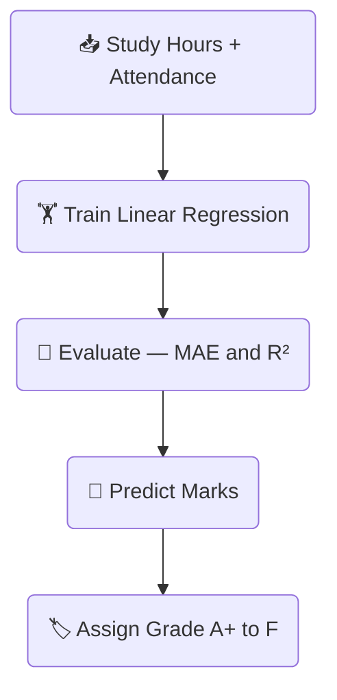
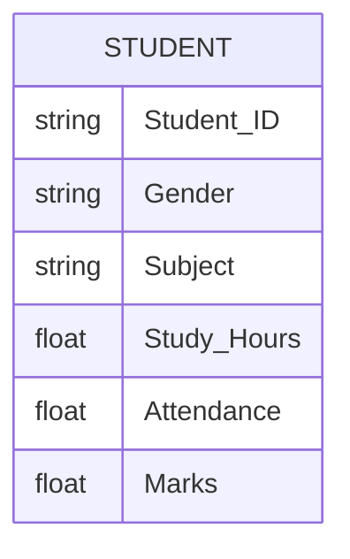

# 🎓 Student Performance Analysis Dashboard

<p align="center">
  
</p>

<p align="center">
  
  
  
  
  
</p>

<p align="center">
  A complete, beginner-friendly <strong>Data Science mini project</strong> built with Python and Streamlit.<br/>
  Analyze student data, visualize patterns, and predict marks — all in an interactive web UI.
</p>

---

## 📦 Tech Stack

| Library | Purpose | Version |
|---|---|---|
| **Streamlit** | Interactive web dashboard UI | ≥ 1.32 |
| **Pandas** | Data loading, cleaning, filtering | ≥ 2.0 |
| **NumPy** | Numerical operations, dataset generation | ≥ 1.24 |
| **Matplotlib** | Bar chart, histogram, scatter plot | ≥ 3.7 |
| **Seaborn** | Correlation heatmap | ≥ 0.12 |
| **Scikit-learn** | Linear Regression model | ≥ 1.3 |

---

## 🔄 Project Architecture


---

## 🤖 ML Pipeline

<p align="center">
  
</p>



---

## 📊 Visualizations Included

```
┌─────────────────────────┬────────────────────────────┐
│  📊 Bar Chart           │  📈 Histogram               │
│  Avg Marks per Subject  │  Marks Distribution         │
├─────────────────────────┼────────────────────────────┤
│  🔵 Scatter Plot        │  🌡️ Heatmap                 │
│  Study Hours vs Marks   │  Correlation Matrix         │
└─────────────────────────┴────────────────────────────┘
```

---

## 🗂️ Dataset Schema



---

## 🏆 Grade Scale

| Score Range | Grade | Label |
|---|---|---|
| 90 – 100 | 🏆 A+ | Outstanding |
| 75 – 89  | 🌟 A  | Excellent |
| 60 – 74  | 👍 B  | Good |
| 50 – 59  | 📘 C  | Average |
| < 50     | ⚠️ F  | Needs Improvement |

---

## 📁 Folder Structure

```
fds/
├── app.py              ← Main Streamlit application (single file)
├── requirements.txt    ← Python dependencies
├── README.md           ← Project documentation
└── assets/
    ├── banner.png      ← Project banner image
    └── ml_workflow.png ← ML pipeline diagram
```

---

## ⚙️ How to Run Locally

### Step 1 — Install Python
Make sure **Python 3.9+** is installed → https://python.org

### Step 2 — Create Virtual Environment *(recommended)*
```bash
python -m venv .venv
.venv\Scripts\activate        # Windows
# source .venv/bin/activate   # macOS / Linux
```

### Step 3 — Install Dependencies
```bash
pip install -r requirements.txt
```

### Step 4 — Run the App 🚀
```bash
streamlit run app.py
```

> The dashboard opens automatically at **http://localhost:8501**

---

## ✨ Features

### 🧹 Data Processing
- Auto-generates 200+ realistic student records
- Handles **missing values** (filled with median)
- Removes **duplicate rows**
- Cleaning report shown in expandable panel

### 📊 Dashboard
- Sidebar filters: **Gender** and **Subject**
- KPI cards: Total Students · Avg Marks · Avg Study Hours · Avg Attendance

### 📈 Visualizations

| Chart | Description |
|---|---|
| **Bar Chart** | Average marks per subject |
| **Histogram** | Marks distribution with mean line |
| **Scatter Plot** | Study Hours vs Marks with gender colors & trend line |
| **Heatmap** | Correlation matrix of numeric features |

### 🤖 Machine Learning
- **Linear Regression** (Scikit-learn)
- Features: `Study_Hours` + `Attendance` → Target: `Marks`
- Metrics: **MAE** and **R²** score displayed in UI

### 🔮 Prediction UI
- Input Study Hours (slider 0–12)
- Input Attendance (slider 40–100%)
- Click **Predict Marks** → shows predicted score + grade badge

### 🎁 Bonus Features
- **📂 Upload Custom CSV** from sidebar
- **⬇️ Download Filtered Data** as CSV

---

## 📝 Section-by-Section Explanation *(for Viva)*

1. **Dataset Generation** — `generate_dataset()` uses NumPy to create 200 students with realistic correlations (more study hours → higher marks) + random noise
2. **Data Cleaning** — `clean_data()` removes duplicates and fills NaN with column median (robust to outliers)
3. **Sidebar Filters** — `st.multiselect()` lets users narrow data by gender/subject dynamically
4. **KPI Metrics** — `st.metric()` shows count/mean stats on the filtered subset
5. **Bar Chart** — `groupby("Subject")["Marks"].mean()` + Matplotlib `ax.bar()`
6. **Histogram** — `ax.hist()` shows spread of marks with mean line
7. **Scatter Plot** — Each point = 1 student; color = gender; dashed = trend line
8. **Heatmap** — Seaborn `heatmap()` on `df.corr()` matrix
9. **Linear Regression** — `sklearn.LinearRegression` fit on 80% data; MAE + R² evaluations
10. **Prediction** — Slider inputs → `model.predict()` → grade label (A+ to F)

---

<p align="center">
  Built with ❤️ for <strong>Foundations of Data Science</strong> · College Submission Project
</p>
